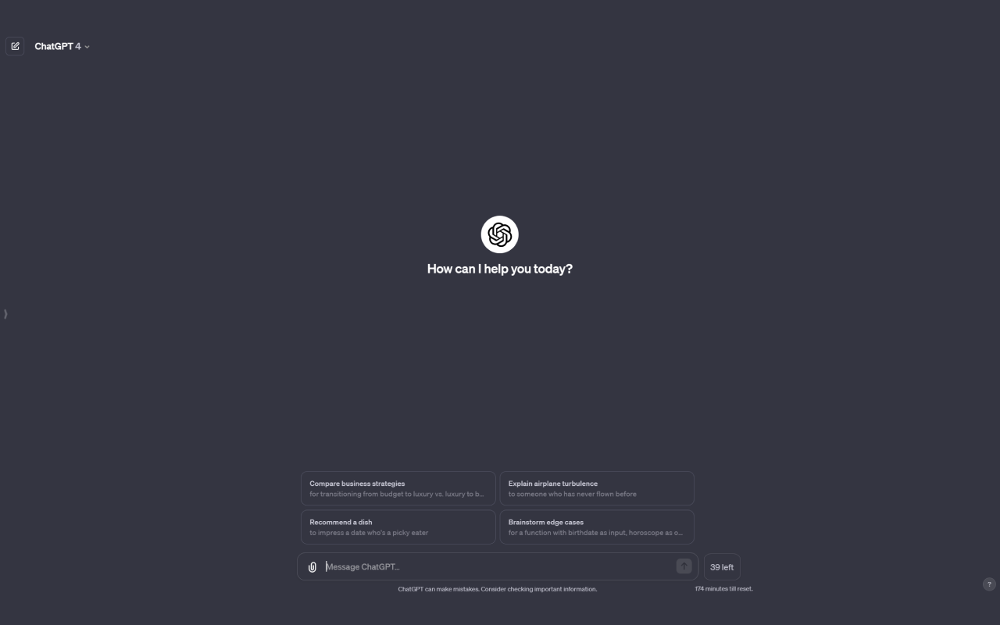

<!-- PROJECT SHIELDS -->

[![Chrome Web Store][chrome-web-store-shield]][chrome-web-store-link]

<!-- PROJECT LOGO -->
 

  

  <h3 align="center">ChatCap for GPT-4</h3>

  

    The freshest mobile application for your photo polls!
     
     
     
  

ChatCap for GPT-4 is a browser extension designed to track your usage with OpenAI's GPT-4 API. It adds a counter and timer directly into the ChatGPT UI, helping you manage your requests efficiently.

## Features

-   **Request Counter:** Monitors the number of requests sent to GPT-4 in real-time.
-   **Time Tracker:** Shows the remaining time until the request limit resets.
-   **Visual Indicators:** Provides a clear display of your usage on the ChatGPT interface.

## Screenshot

## Installation

In case you dont want to get the extension from the Chrome Web Store, you can install it manually by following the steps below.

### For Google Chrome

1. Clone or download this repository.
2. Navigate to `chrome://extensions/` in Chrome.
3. Enable **Developer mode**.
4. Click **Load unpacked** and select the extension directory.

### For Microsoft Edge

1. Clone or download this repository.
2. Navigate to `edge://extensions/` in Edge.
3. Enable **Developer mode**.
4. Click **Load unpacked** and select the extension directory.

## Contributing

We love your input! We want to make contributing to this project as easy and transparent as possible, whether it's:

-   Reporting a bug
-   Discussing the current state of the code
-   Submitting a fix
-   Proposing new features
-   Becoming a maintainer

### We Develop with Github

We use github to host code, to track issues and feature requests, as well as accept pull requests.

**Report Issues:**

-   Found a problem? Open an issue [here](https://github.com/ChoosyApp/gpt4-message-tracker/issues).

**Send Pull Requests:**

-   Fork the repo.
-   Create a new branch.
-   Make changes.
-   Issue that pull request!

**Remember:**

-   Contributions are under the MIT License.

**Thanks for your support!**

## Contact

Apostolis Garos - [LinkedIn](https://www.linkedin.com/in/apostolis-garos/) - [apostolisgaros@gmail.com](mailto:apostolisgaros@gmail.com)

Nick Vlachakis - [LinkedIn](https://www.linkedin.com/in/nikos-vlachakis/) - [nvlachakis1999@gmail.com](mailto:nvlachakis1999@gmail.com)

## License

Distributed under the MIT License. See `LICENSE.txt` for more information.

<!-- MARKDOWN LINKS & IMAGES -->
<!-- https://www.markdownguide.org/basic-syntax/#reference-style-links -->

[contributors-shield]: https://img.shields.io/github/contributors/othneildrew/Best-README-Template.svg?style=for-the-badge
[contributors-url]: https://github.com/ApostolisGaros/ChoosyProject/graphs/contributors
[forks-shield]: https://img.shields.io/github/forks/othneildrew/Best-README-Template.svg?style=for-the-badge
[forks-url]: https://github.com/ApostolisGaros/ChoosyProject/network/members
[stars-shield]: https://img.shields.io/github/stars/othneildrew/Best-README-Template.svg?style=for-the-badge
[stars-url]: https://github.com/ApostolisGaros/ChoosyProject/stargazers
[issues-shield]: https://img.shields.io/github/issues/othneildrew/Best-README-Template.svg?style=for-the-badge
[issues-url]: https://github.com/ApostolisGaros/ChoosyProject/issues
[license-shield]: https://img.shields.io/github/license/othneildrew/Best-README-Template.svg?style=for-the-badge
[license-url]: https://github.com/ApostolisGaros/ChoosyProject/blob/master/LICENSE.txt
[instagram-shield]: https://img.shields.io/badge/-Instagram-black.svg?style=for-the-badge&logo=instagram&colorB=555
[instagram-link]: https://www.instagram.com/choosy_app/
[chrome-web-store-shield]: https://img.shields.io/badge/-Chrome_Web_Store-black.svg?style=for-the-badge&logo=googlechrome&colorB=555
[chrome-web-store-link]: https://chromewebstore.google.com/?hl=el
